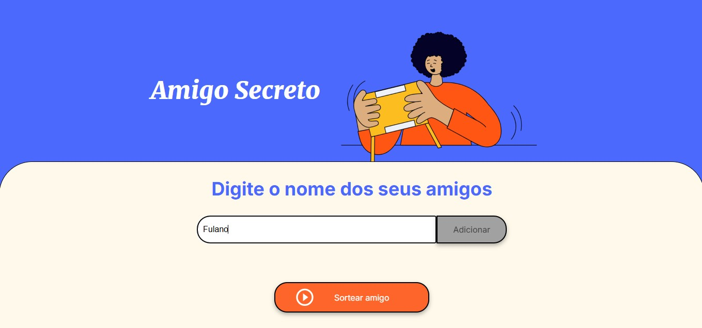
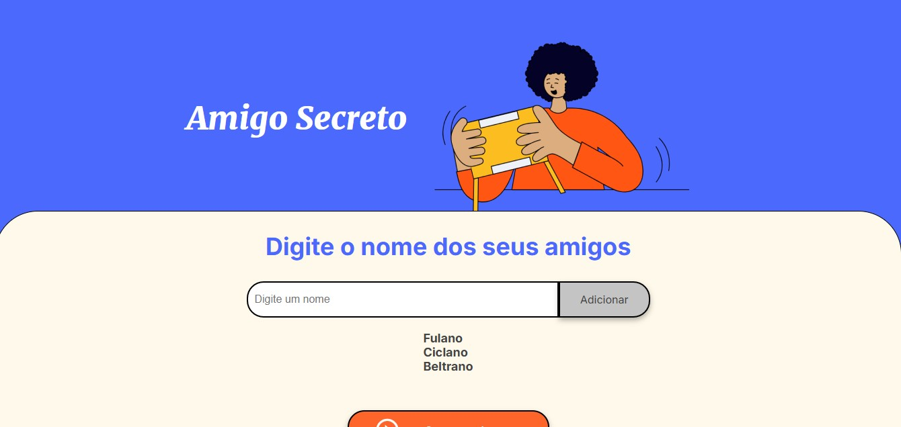
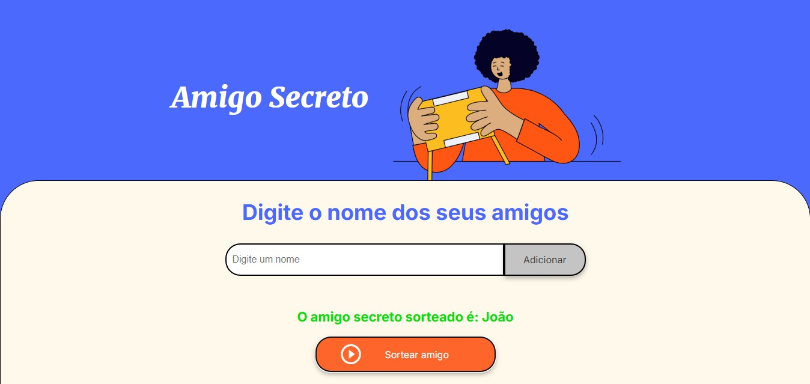

# Sorteio de Amigo Secreto 🎁

Este projeto é a solução para o **challenge de lógica de programação** proposto pela Alura e Oracle One. Ele consiste em criar um programa que permita inserir nomes de amigos, realizar um sorteio de Amigo Secreto!

---

## 🛠️ Funcionalidades

- **Cadastro de Participantes**: Adicione uma lista de nomes para o sorteio.
- **Sorteio**: Realize o sorteio clicando em um botão.

---

## 🚀 Tecnologias Utilizadas

- **Linguagem**: [HTML, CSS, JavaScript]

---

## 🎯 Objetivo do Projeto

Este projeto foi desenvolvido para:

1. Praticar lógica de programação.
2. Trabalhar com listas, aleatoriedade e validação de dados.

---

## 🧑‍💻 Como Executar o Projeto

1. **Clone este repositório**:
   ```bash
   git clone https://github.com/crusaderMD/Desafio-Amigo-Secreto-Alura-OracleOne
   ```
2. **Acesse a pasta do projeto**:
   ```bash
   cd Desafio-Amigo-Secreto-Alura-OracleOne
   ```
3. **Instale as dependências** (se aplicável):
   ```bash
   [Comando de instalação, ex: npm install, pip install -r requirements.txt, etc.]
   ```
4. **Execute o programa**:
   ```bash
   [Comando de execução, ex: python main.py, npm start, etc.]
   ```

---

## 🔥 Exemplos de Uso

### Entrada:
Adicione os participantes escrevendo os nomes no campo e clicando em "adicionar":
```text
Maria, João, Ana, Pedro
```


Os nome adicionados aparecerão em uma lista abaixo do campo de inserção: 



### Saída:

Clique no botão "sortear amigo"



---

## 💡 Aprendizados

Este projeto permitiu o desenvolvimento de habilidades como:

- Manipulação de listas e estruturas de dados.
- Uso de funções e algoritmos para validações específicas.
- Geração de números aleatórios com restrições.
- Pensamento lógico para resolver problemas reais.

---

## 🤝 Contribuições

Sinta-se à vontade para contribuir com melhorias no projeto! Abra uma **issue** ou envie um **pull request** com suas sugestões. Vamos construir juntos! 🚀

---

## 📜 Licença

Este projeto está licenciado sob a [MIT License](LICENSE). Sinta-se à vontade para usá-lo e adaptá-lo como preferir.

---

Feito com ❤️ por [Luiz R. Bortolotti Jr.](https://github.com/crusaderMD). 😄


